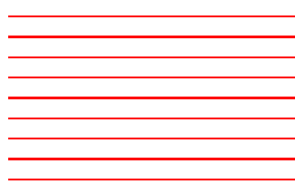

### 背景

  最近在做项目的时候，需要做一个状态组件，类似下图效果:

  

  通常情况下，我们都会通过css伪类实现上面的进度条的效果，于是乎三下五除二就把组件搞出来了，看样子也没什么问题，然后调用接口进行列表渲染时，发现渲染出来的进度条粗细显示有差异：

  

  然后问题来了，为什么同样的样式（F12定位查看的computed样式也是一样），最终渲染的效果确是不同的？
### 原因

  按照以往经验，首先从自身代码上猜测可能引起问题的原因：
  1. css伪类使用姿势不正确，或页面其他样式影响导致；
  2. rem布局导致实际计算和渲染的px是带小数的，影响渲染效果，具体原理未知。

经排查，没有发现css使用姿势的问题，那就很可能是带小数px实际渲染效果会不一致，具体原因还需要进一步了解。直接问部门leader，leader也猜测是小数px的问题，因为尝试直接用整数px是没有问题的。后面本地写了个html文件验证小数px渲染的确是有问题的（*每条线的高度都为2.35px*）：

后续还是部门leader直接搜索到了相关答案，**本质就是浏览器针对小数px的渲染机制就是如此的（四舍五入的原则）**，简单地说就是：

1. 假如页面某元素的高度1.5px，则向上取整为2px(1.5px+0.5px)进行渲染；
2. 临近的后一个元素则需补缺(0.5px)，即渲染高度为1px(1.5px-0.5px)。

具体可以参考[知乎](https://www.zhihu.com/question/264372456)、[维基百科](https://www.wikiwand.com/en/Subpixel_rendering)的解释。
### 解决方案

知道了原因，解决方式就简单些了，针对某些特定设计，保留整数px，可直接将css像素单位改为Px(PX/pX)，不做rem转换：
1. 如果是使用px2rem相关插件，可以配置大写PX不做rem转换即可；
2. 如果是vscode prettier插件自动格式化了PX为小写，则可以直接添加注释忽略掉大小写的转换，如下图：

### 总结

遇到问题还是要多留心，不管问题大小，总是学习的机会，加油！

### 参考资料

1. *[浏览器亚像素渲染与小数位的取舍](https://isux.tencent.com/articles/105.html)*
2. *[浏览器将rem转成px时有精度误差怎么办？](https://www.zhihu.com/question/264372456)*
3. *[Subpixel rendering](https://www.wikiwand.com/en/Subpixel_rendering)*